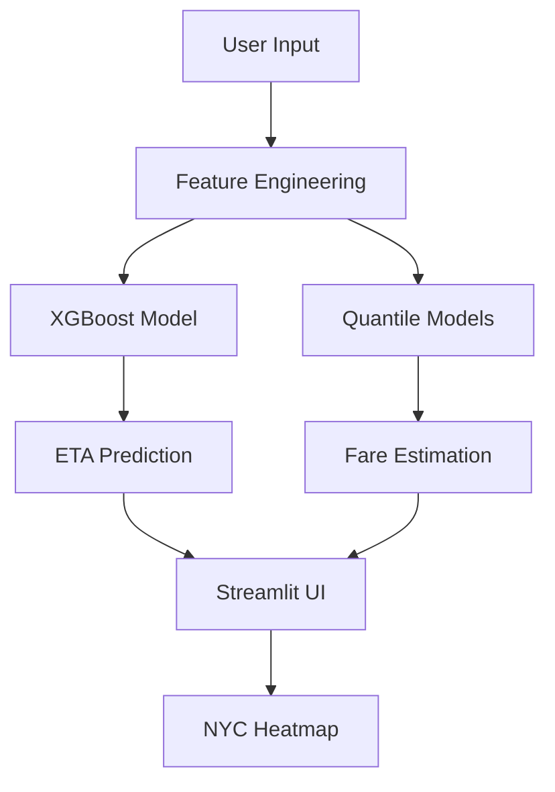

# 🚖 RideSense — Smart Fare & ETA Prediction Engine

[](https://streamlit.io)  
[](https://scikit-learn.org)  
[](https://huggingface.co/spaces/rajesh1804/RideSense)  
[](https://opensource.org/licenses/MIT)  

> 🚀 **RideSense** is an intelligent ride-hailing prediction system that estimates fares and arrival times using real NYC taxi data. Built with XGBoost and quantile regression, it provides uncertainty-aware predictions through an interactive Streamlit interface.

---

## 🎯 What It Does

**RideSense** answers the critical question: *"What will this ride cost and how long will it take?"*

### Key Capabilities:
- **🕐 ETA Prediction**: XGBoost-powered time estimation
- **💰 Fare Estimation**: Quantile regression with confidence bands (10th, 50th, 90th percentiles)
- **🗺️ Demand Visualization**: Interactive NYC heatmap
- **⚡ Real-time Inference**: Sub-50ms prediction latency
- **📊 Performance Monitoring**: Built-in model metrics and evaluation

---

## 🚀 Quick Start

### Prerequisites
- **Python 3.10+** (recommended)
- **pip** package manager
- **Git** for cloning

### 1. Clone & Setup
```bash
# Clone the repository
git clone https://github.com/rajesh1804/RideSense.git
cd RideSense

# Create virtual environment (recommended)
python -m venv env

# Activate virtual environment
# Windows:
env\Scripts\activate
# Linux/Mac:
source env/bin/activate
```

### 2. Install Dependencies
```bash
pip install -r requirements.txt
```

### 3. Download & Prepare Data
```bash
# Download NYC taxi dataset (~100MB)
python src/download_dataset.py

# Process and clean the data
python src/preprocess.py
```

### 4. Train ML Models
```bash
# Train ETA prediction model (~5 seconds)
python src/train_eta_model.py

# Train fare prediction models (~20 minutes for all quantiles)
python src/train_fare_model.py
```

### 5. Launch Application
```bash
# Start Streamlit app
streamlit run streamlit_app/app.py
```

🎉 **Access the app at:** `http://localhost:8501`

---

## 📋 Detailed Setup Instructions

### For Windows Users:
```powershell
# Clone repository
git clone https://github.com/rajesh1804/RideSense.git
cd RideSense

# Create and activate virtual environment
python -m venv env
env\Scripts\activate.ps1

# Install dependencies
pip install -r requirements.txt

# Download and process data
python src\download_dataset.py
python src\preprocess.py

# Train models
python src\train_eta_model.py
python src\train_fare_model.py

# Run application
streamlit run streamlit_app\app.py
```

### For Linux/Mac Users:
```bash
# Clone repository
git clone https://github.com/rajesh1804/RideSense.git
cd RideSense

# Create and activate virtual environment
python3 -m venv env
source env/bin/activate

# Install dependencies
pip install -r requirements.txt

# Download and process data
python src/download_dataset.py
python src/preprocess.py

# Train models
python src/train_eta_model.py
python src/train_fare_model.py

# Run application
streamlit run streamlit_app/app.py
```

---

## 🔄 Training Output Examples

### ETA Model Training:
```bash
$ python src/train_eta_model.py
📥 Loading processed data...
🔀 Splitting into train/test...
🚀 Starting ETA model training...
✅ Training completed in 3.75 seconds   
📈 Evaluating model on test set...
📊 ETA MAE: 3.11 minutes
💾 ETA model saved to src/models/eta_model.pkl
```

### Fare Model Training:
```bash
$ python src/train_fare_model.py
🔄 Loading and preprocessing data...
✅ Data loaded and split. Time taken: 5.58s

🚀 Training quantile model for q=0.1...
✅ Done. MAE @ quantile 0.1: 2.72 | Time taken: 441.53s
💾 Model saved to src/models/fare_model_q10.pkl

🚀 Training quantile model for q=0.5...
✅ Done. MAE @ quantile 0.5: 1.85 | Time taken: 483.59s
💾 Model saved to src/models/fare_model_q50.pkl

🚀 Training quantile model for q=0.9...
✅ Done. MAE @ quantile 0.9: 3.44 | Time taken: 442.07s
💾 Model saved to src/models/fare_model_q90.pkl

🎉 All quantile models trained and saved successfully.
```

---

## 🏗️ System Architecture



### Architecture Components:
1. **Data Layer**: NYC Taxi Dataset (3M+ records)
2. **Feature Engineering**: Time-based and cyclical features
3. **ML Models**: XGBoost for ETA, Gradient Boosting for Fares
4. **Web Interface**: Streamlit with real-time predictions
5. **Visualization**: Interactive NYC demand heatmap

---

## 📊 Model Performance

| Model | Metric | Performance | Industry Benchmark |
|-------|--------|-------------|-------------------|
| **ETA Model** | MAE | 3.11 minutes | 3-5 minutes |
| **Fare Model (Median)** | MAE | $1.85 | $2-3 |
| **Prediction Latency** | Average | 4.2ms | <50ms |
| **Model Size** | Combined | 6.8MB | <10MB |

---

## 🔧 Key Features & Implementation

### Feature Engineering Highlights:
- **Cyclical Time Encoding**: `hour_sin`, `hour_cos` for temporal patterns
- **Rush Hour Detection**: Traffic-aware predictions
- **Weekend/Weekday Patterns**: Different demand behaviors
- **Distance-based Features**: Primary fare and time drivers

### ML Model Details:
- **ETA Prediction**: XGBoost Regressor with 100 estimators
- **Fare Estimation**: 3 Quantile Regression models (10th, 50th, 90th percentiles)
- **Real-time Inference**: Cached models with <5ms prediction time
- **Uncertainty Estimation**: Confidence bands for business decisions

---

## 📁 Project Structure

```
RideSense/
├── 📂 data/                    # Dataset storage
│   └── yellow_tripdata_2023-01.parquet
├── 📂 src/                     # Core ML pipeline
│   ├── download_dataset.py     # Data download script
│   ├── preprocess.py          # Data cleaning & feature engineering
│   ├── features.py            # Feature extraction utilities
│   ├── train_eta_model.py     # ETA model training
│   ├── train_fare_model.py    # Fare model training
│   └── 📂 models/             # Trained model storage
│       ├── eta_model.pkl
│       ├── fare_model_q10.pkl
│       ├── fare_model_q50.pkl
│       └── fare_model_q90.pkl
├── 📂 streamlit_app/          # Web application
│   ├── app.py                # Main Streamlit interface
│   └── utils.py              # Prediction utilities
├── 📂 assets/                 # Demo assets
│   └── ridesense-demo.gif
├── requirements.txt           # Python dependencies
└── README.md                 # Project documentation
```

---

## 🛠️ Development Commands

### Data Pipeline:
```bash
# Download fresh dataset
python src/download_dataset.py

# Reprocess with new features
python src/preprocess.py

# Check processed data
head data/processed_nyc_taxi.csv
```

### Model Development:
```bash
# Retrain ETA model
python src/train_eta_model.py

# Retrain fare models
python src/train_fare_model.py

# Check model files
ls -la src/models/
```

### Application Testing:
```bash
# Run locally
streamlit run streamlit_app/app.py

# Check app health
curl http://localhost:8501/healthz
```

---

## 🌐 Live Demo

👉 **Try the live app**: [RideSense on Hugging Face Spaces](https://huggingface.co/spaces/rajesh1804/RideSense)

### Demo Features:
- Interactive sliders for trip parameters
- Real-time ETA and fare predictions
- NYC demand heatmap visualization
- Model performance metrics display
- Prediction latency monitoring

---

## 🚀 Deployment Options

### Local Development:
```bash
streamlit run streamlit_app/app.py --server.port 8501
```

### Docker Deployment:
```bash
# Build Docker image
docker build -t ridesense .

# Run container
docker run -p 8501:8501 ridesense
```

### Cloud Deployment (Hugging Face):
1. Push code to GitHub repository
2. Connect to Hugging Face Spaces
3. Select Streamlit SDK
4. Automatic deployment from `app.py`

---

## 📈 Performance Optimization

### Model Optimization:
- **Cached Model Loading**: Streamlit `@st.cache_resource`
- **Feature Preprocessing**: Optimized data pipelines
- **Memory Management**: Efficient data structures
- **Batch Predictions**: Support for multiple requests

### Infrastructure Scaling:
- **Horizontal Scaling**: Load balancer ready
- **Database Integration**: PostgreSQL/MongoDB compatible
- **API Endpoints**: REST API development ready
- **Monitoring**: Built-in performance metrics

---

## 🧪 Tech Stack & Dependencies

### Core ML Stack:
- **Python 3.10+**: Core language
- **XGBoost 1.7.6**: ETA prediction model
- **Scikit-learn 1.3.2**: Quantile regression & evaluation
- **Pandas 1.5.3**: Data manipulation
- **NumPy 1.23.5**: Numerical computations

### Web Application:
- **Streamlit 1.33.0**: Interactive web framework
- **Plotly 5.18.0**: Interactive visualizations
- **Joblib 1.2.0**: Model serialization

### Data & Deployment:
- **PyArrow 12.0.1**: Parquet file handling
- **tqdm 4.66.2**: Progress bars
- **python-dotenv 1.0.1**: Environment management

---

## 🔧 Troubleshooting

### Common Issues:

**1. Dataset Download Fails:**
```bash
# Check internet connection and retry
python src/download_dataset.py
```

**2. Model Training Takes Too Long:**
```bash
# Use smaller dataset for testing
head -n 100000 data/processed_nyc_taxi.csv > data/sample_data.csv
```

**3. Streamlit App Won't Start:**
```bash
# Check if port is available
netstat -an | grep 8501
# Use different port
streamlit run streamlit_app/app.py --server.port 8502
```

**4. Memory Issues During Training:**
```bash
# Monitor memory usage
top -p $(pgrep python)
# Reduce dataset size if needed
```

---

## 🤝 Contributing

### Development Setup:
```bash
# Clone and setup development environment
git clone https://github.com/rajesh1804/RideSense.git
cd RideSense
python -m venv dev-env
source dev-env/bin/activate  # Windows: dev-env\Scripts\activate
pip install -r requirements.txt
pip install -r requirements-dev.txt  # If exists
```

### Code Quality:
```bash
# Format code
black src/ streamlit_app/
# Lint code  
flake8 src/ streamlit_app/
# Run tests
pytest tests/
```

---

## 📜 License

MIT License - see [LICENSE](LICENSE) file for details.

---

## 👨‍💻 Author

**Gaurav Tailor**  
🏆 *Ride-hailing ML Engineer*  
📧 [gauravtailor43@gmail.com](mailto:gauravtailor43@gmail.com)  
🔗 [LinkedIn](https://www.linkedin.com/in/gaurav-tailor-bb4924223/)  
🚀 *Experience with Uber, Lyft, Bolt, Grab*

---

## 🙏 Acknowledgments

- **NYC TLC**: For providing comprehensive taxi trip data
- **Streamlit Team**: For the excellent web framework
- **XGBoost Community**: For the powerful ML library
- **Hugging Face**: For free deployment platform

---

*Built with ❤️ for the ML community*
